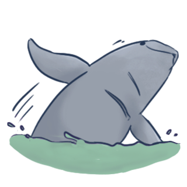

# django-mahakam-dolphin-ads
MahakamDolphinAds is a Django-based web application that allows businesses to create and manage their online advertising campaigns.

<p align="center">
  
</p>
<p align="center">
    <a href="https://www.ykrasi.org/">Join conservation efforts to save the Mahakam River Dolphins</a>
</p>
<p align="center">
Illustration by <a href="https://www.deviantart.com/salty-chiku" >salty-chiku</a>
</p>

# Table of Content

- [Prerequisites](#prerequisites)
- [Getting Started](#getting-started)
- [Documentation](#documentation)


# Prerequisites


Before installing any packages, make sure to first create a Python virtual environment using the `virtualenv` or `venv` command.

To create a Python virtual environment using the `virtualenv` command, you can use the following:

```
# install virtualenv package if it is not already installed
pip install virtualenv

# create a virtual environment in the current directory
virtualenv myenv

# activate the virtual environment
source myenv/bin/activate
```

To create a Python virtual environment using the `venv` command, you can use the following:

```
# create a virtual environment in the current directory
python -m venv myenv

# activate the virtual environment
source myenv/bin/activate
```
Then, install all necessar pacagkes listed in `requirements.txt`:

```
pip install -r requirements.txt
```

# Getting Started

To get started, please clone the repository.

```
git clone https://github.com/gilangrilhami/django-mahakam-dolphin-ads.git
```

There are 3 steps we need to do to start the project:
1. [Migration](#migration)
2. [Ingestion](#ingestion)
3. [Serving](#serving)

## Migration
There are three Django apps in the project: `sites`, `advertisements`, and `dashboard`. The last app has a seperate migration condition (lives in a different database) then the first two. Therefore, we have to migrate `sites`, `advertisements` first, [create a super user](https://docs.djangoproject.com/en/4.1/intro/tutorial02/#creating-an-admin-user), and then migrate `dashboard`.

To migrate the first two app, use the following:

```
python manage.py migrate sites
python manage.py migrate advertisements
```

Then, we need to create a super user for the project:

```
python manage.py createsuperuser
```

Finally, migrate the `dashboard` app using the `dashboard` dastabase:

```
python manage.py migrate dashboard --dashboard=dashboard
```


## Ingestion

After migration, we need to ingest dummy data to the database using `Faker` package. Various Django commands have been provided to perform ingestion which follows the following steps:

1. Ingest dummy data to the `sites` app
    
    ```
    python manage.py populate_sites
    ```

2. Ingest dummy data to the `advertisements` app
    
    ```
    python manage.py populate_advertisements
    ```
3. Assign existing `Slot`s to `AdvertisementGroupTargetingRule`
    
    ```
    python manage.py assign_slots_to_targeting_rules

    ```
3. Ingest data to `dashboard` app
    
    ```
    python manage.py ingest_data

    ```

## Serving

Finally, we serve the project with the following command:

```
python managem.py runserver
```

# Documentation


Project documentation is generated with [Django admin documentation generator](https://docs.djangoproject.com/en/4.1/ref/contrib/admin/admindocs/) in capability and is accessible via the `/admin/doc` path.